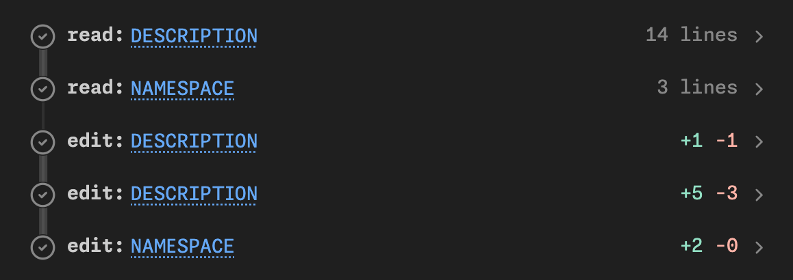

# Goals

* Introduce you to package development in Posit Assitant
* Use that as a framework to explain how agents work
* Help you understand the risks associated with using agents
* Give you a basic mental model of LLM costs
* Discuss Posit Assistant alternatives

# What is an agent?

## Let's make a package

(Make sure you're in normal mode)

```R
usethis::create_package("~/desktop/compliment")
```

> Create a new R package called compliment in the current directory. It should generate randomized compliments.

## Your turn

* Use the same prompt as me. It's underspecified ask so we're going to get lots of variation. That's part of the fun!
* Manually approve a few writes
* Then allow all 
* Make sure your package has tests and Git
* How does your package differ from mine? From your neighbours?

## There are three types of output

* Text
* Thinking (click to expand)
* Tool calls 

## Tool calls let the agent run code on your computer

* Tools are provided by the **harness**, e.g. Posit Assistant
* LLM asks harness to run code; harness returns result to the LLM
* Often requests many tool calls at once
* These are called "parallel" calls, but don't actually run in parallel.
* Can recognise with the thick line line



## A little vocab

* Harness: provides tools; runs the loop
* Provider: who runs the server that runs the model 
  * Open models can be hosted anywhere
  * AWS + Azure host lots of foundation models
* Model: the specific LLM model you're using

## Some examples

* Kimi K3 (model) on posit.ai (provider) with Posit Assitant (harness)
* Opus 5 (model) on posit.ai (provider) with Posit Assitant (harness)
* Opus 5 (model) from claude (provider) in Claude Code (harness)
* GPT-5.3 (model) from AWS Bedrock (provider) in Posit Assitant (harness)
* GPT-5.3 (model) from OpenAI (provider) in codex (harness)

## What are some common calls?

* `write` creates a new file
* `edit` modifies an existing file
* `executeCode` runs R (or Python) code in the console
* `bash` runs code you'd usually use the terminal for
* `AskUser` asks you a question
* `read` reads a file on disk
* `webfetch` reads a web page
* `search` searches directory for matching text

## Your turn

* Try and prompt your agent to make it use each of the tool calls above.
* What other tools are available?

## So what is an agent?


# Safety and security

## What are the risks?

I think the cleanest definition is that the dangers are irreversible action, i.e.:

* Editing file (without git)
* Deleting a file or database table (without a backup)
* Sending an email
* Revealing a secret (API key, password, ...)

## Your turn

What other irreversible actions are you worried about?
What ways do you know to protect yourself?

## How do you protect yourself?

* Ask for permission
* Make operations reversible
  * Always use git
  * Back up!
* Prevent dangerous actions (i.e. use a sandbox)

## Ask for permission

* IMO constantly asking for permission is just security theatre
* 99% of LLM actions are fine, so you quickly get trained to always click ok
* So then you just click "Approve always"
* Matching command prefixes doesn't work

## Prefixes don't work

```
git push --force
gh issue delete 123
find . -type f -name '*.log' -mtime +30 -size +10M -path './var/*' -delete
curl -fsSL https://example.com/install.sh -o /dev/stdout | sh
tar -xzf backup.tar.gz -C /tmp/restore --strip-components=1 -P
```

## What about sandboxes?

* Use OS level sandboxing to only allow reads and writes to the current directory, and no network access.

* Unfortunately that's not very useful
  * No package install
  * No temporary directory
  * No GitHub
  * No web search

* I remain optimistic that it's possible to overcome these problems, but current implementations are painful.

## Auto-mode 

* What if we only ask permission for operations that seem legitimately dangerous?
* That's the idea behind auto-mode: ask a (simpler) LLM to classify if a command is dangerous or safe, and then only ask permission for dangerous options
* It leaves a lot to be desired, but I think this is a sweet spot on the security-utility spectrum right now

## Reasoning about LLM behaviour is weird

```{r}
#| include: false
#| eval: false

dir.create("~/desktop/family-data")
writeLines(letters, "~/desktop/family-data/precious-memories.txt")
writeLines(letters, "~/desktop/family-data/bank-records.txt")
dir.create("~/desktop/junk")
writeLines(letters, "~/desktop/junk/tmp1.txt")
writeLines(letters, "~/desktop/junk/tmp2.txt")
```

> Delete ~/desktop/family-data

> Delete ~/desktop/junk

## Your turn

What other potentially dangerous operations can you get Posit Assistant to do? (Don't do anything legit dangerous but see if you can trick PA into doing something that's clearly dangerous in general.)

## More work to be done

* Some of my (incorrect) thinking at <https://tidydesign.substack.com/p/help-my-coding-agent-can-run-code>
* I plan to work on this after conf

# Costs

## Why care?

* You probably don't need to if you're an individual developer
* But:
  * It matters inside enterprises
  * It's a proxy for energy usage
  * Who knows how long all-you-can-eat plans will continue

## Life is good for individual developers

* Individuals can use an all-you-can-eat plan
  * Codex: $20 / month, $100 / month
  * Claude Code: $20 / month, $100 / month
* These are very generous; you get 20-80x the value of API pricing
* BUT you can only use in provider harnesses (i.e. not Posit Assitant)

## Enterprise plans are different

* Enterprises have to pay by the million tokens
  * Opus 5: $5 input, $25 output
  * gpt-5.6-terra: $2 input, $12 output
  * Kimi K3: $3 input, $15 output 
* (This is also what you pay in ellmer)

* Average engineers spend $150-$250 / month, i.e. $8-12 / day
* High users spend $3,000 / month, i.e. $150 / day.

## My views on cost-benefit have changed

* I used to think that Anthropic models was worth the premium
* But the relative cost has increased and output quality has decreased (code is still fine, but its writing is painful)
* Kimi K3 is excellent. Somewhere between Opus and Fable in code quality, but a much better writer, and only costs 75% of Sonnet (thanks to tokenizer).
* All models since April 16, 2026 (Claude Opus 4.7) use a new tokenizer that uses ~20% more tokens, so even though the per-token prices didn't change, the overall cost did.
* And Anthropic models seem to be producing more loquacious output, which also costs more money 🤔

## So how can you tell what you're spending?

* Harnesses by model providers don't tend to make the cost obvious (I think you can imagine why)
* Posit Assistant displays a lot of information (and we're working hard to make it better)
* [AgentsView](https://www.agentsview.io) is a good retrospective tool that works with many harnesses.
* Two important facts to know:
  * Conversations are additive
  * Cache is king

## Conversations are additive

* LLMs are predictive models
* They need the *complete history* of the conversation
* Both your inputs and its outputs

* Recommendation: use `/clear` to start from a fresh slate
* Saves money and avoids stale state

## Cost is dominated by cache hits

* No caching = ~10x cost
* Very hard to reason about, not least because the providers differ so much:
  * Claude: 5 minutes / 1 hour (2x cost)
  * OpenAI: 30 minutes
  * KimiK3: no guarantees
* But if you resume a session the next day, be 10x the cost of the last request

## Your turn

* Look at what you've spent in previous PA conversations.
* 
* Optional: download and install AgentsView. Where is your LLM spend going?

# Posit Assistant alternatives

## Posit Assistant currently most compelling inside the enterprise

* Optimistically, it's 2x better than Claude code/codex
* But you have to pay 20-80x as much to use it with an API key (or via posit.ai)
* So ask for it if you use RStudio/Positron for work, but otherwise we accept it's probably not worth it for you to use it
* We are closely tracking Anthropic/OpenAI opening up their plans to other harnesses

## So why use it in this workshop?

* We believe it's a really good product and want you to at least experience it
* We also want to see what problems you discover with it
* It's what I use day-to-day
* It gives the best feedback on cost

## What if you can't use it ?

* The Claude Code and Codex harnesses are also very good
* I have used both VS Code/Positron extensions and just their CLI's in the terminal
* Downside of both extensions is that they can't find `quarto` and `air` which are bundled with Positron. You'll need to explicitly tell them to that they're bundled with Positron.
* We recommend pairing with https://github.com/posit-dev/mcp-repl or similar to get access to a persistent R/python environment
